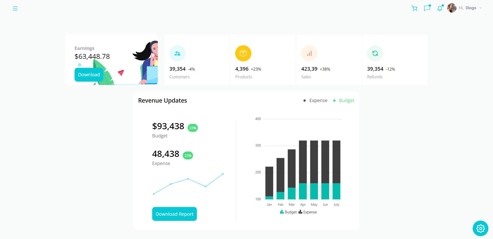
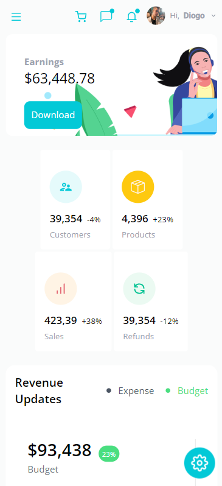
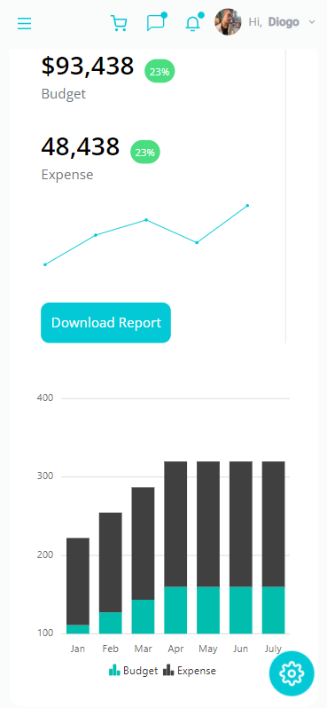

# React Admin Dashboard

Build and Deploy a React Admin Dashboard App With Theming, Tables, Charts, Calendar, Kanban and More

Link da plataforma <https://dashboard-diogo0602x.vercel.app//>

Build a fully functional calendar, a kanban board, a WYSIWYG editor, and a color picker, as well as seven different charts with **ReactJs**.

In this application I learned to:

- Advanced React Best Practices such as folder and file structure, hooks, and refs
- Advanced State Management of the entire application using React Context API
- How to use Syncfusion - World's Best UI Component Suite for Building Powerful Web, Desktop, and Mobile Apps

The platform uses **ReactJs** and **Syncfusion** to to the UI Components.

In addition, the application is fully responsive and all styling was done using the framework **TailwindCSS**.

## Technologies/services/practices used

- React.js
- Syncfusion
- React Context API
- TailwindCSS
- Hooks
- Folder and file structure
- Refs